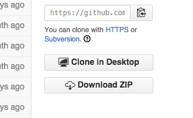
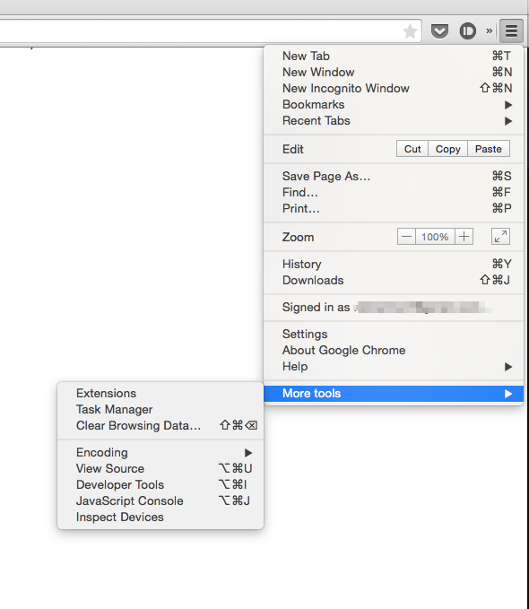
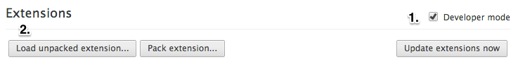

chrome extension that tracks time you spent online in order to increase your productivity.
If you're a developer and can help improve this project. Any Contribution is appreciated.

## Installation
1. Click on the "Download Zip" button visible at the bottom right corner.

    

2. Once downloaded, extract the folder inside the zip file to a location of your choice.

3. Next step is to launch Chrome, Click on the hamburger menu > More Tools > Extensions

    

4. Next steps is to (1.) Check Developer Mode, (2.) Click on Load Unpacked Extension

    

5. In the new window that pops up select the folder that you extracted in the third step.

6. The extension is now installed and ready to use.
